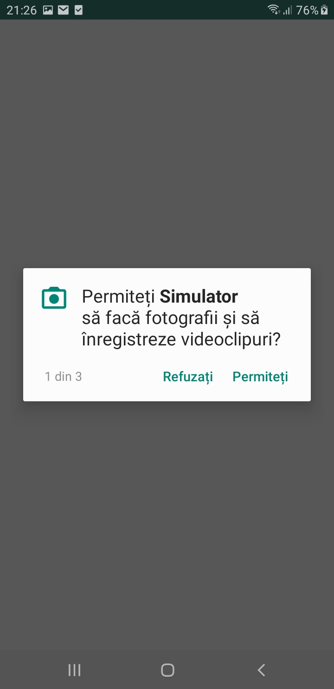
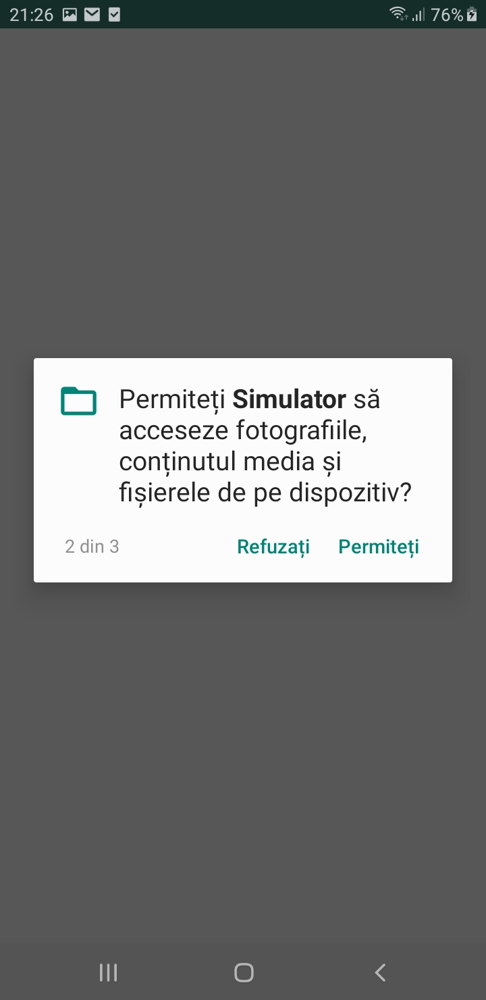
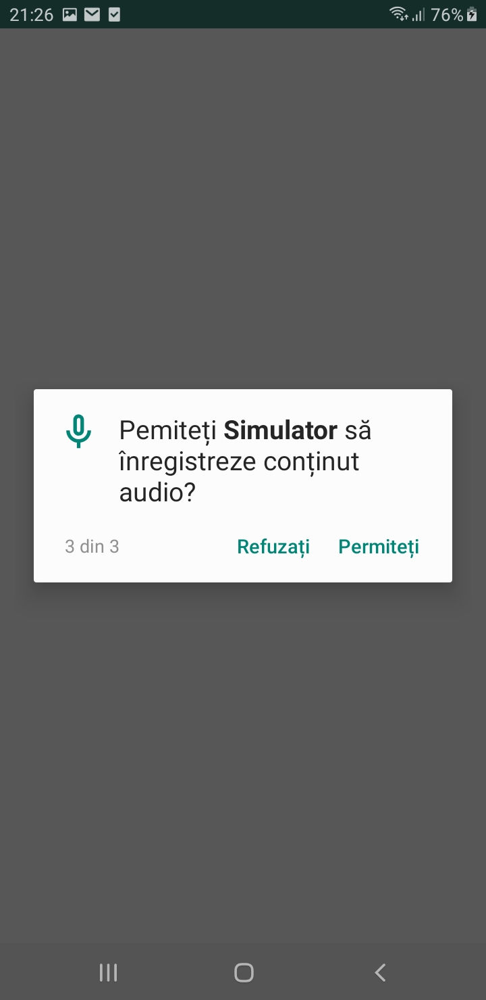
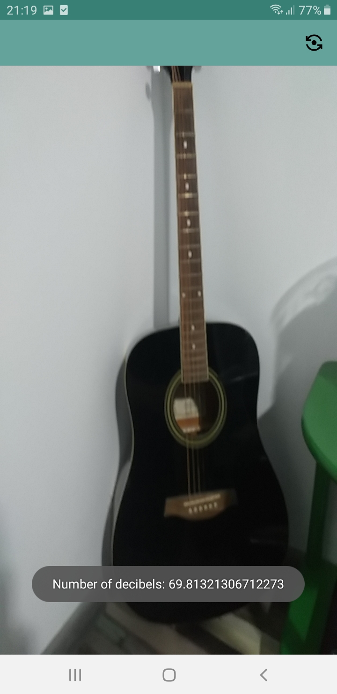
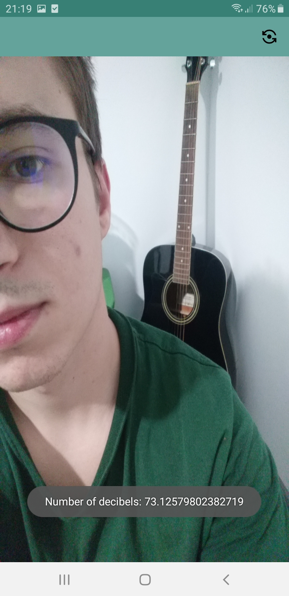
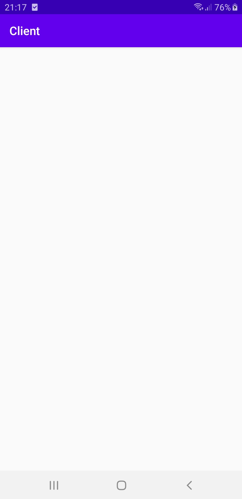
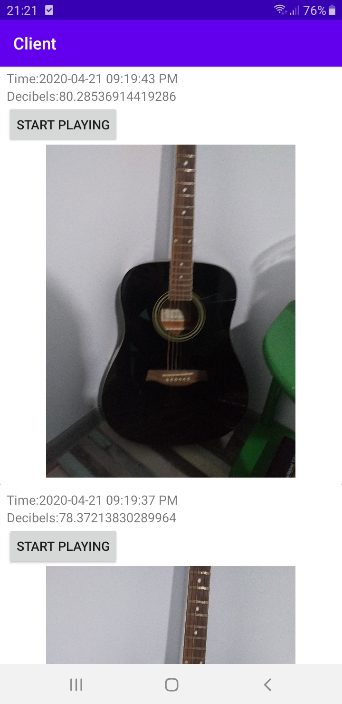
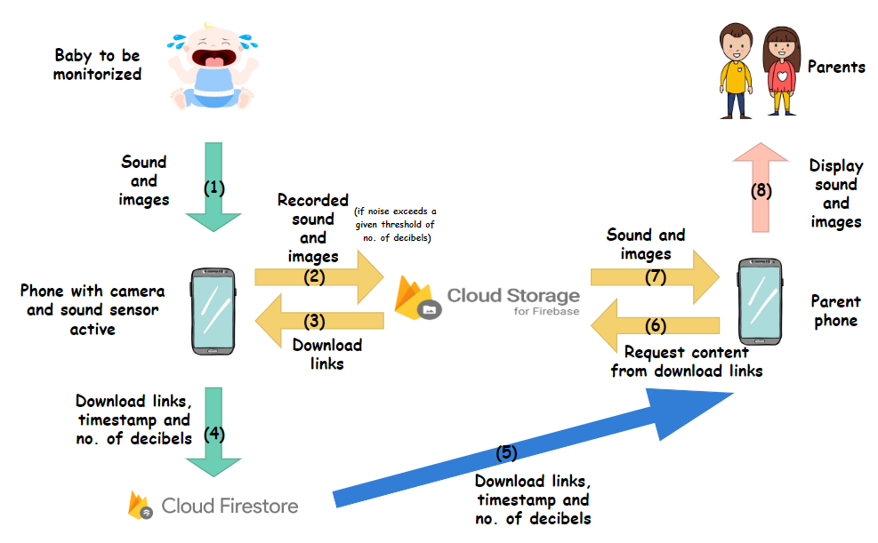

# Pseudo BabyPhone #
## Overview ##
We will create a pseudo BabyPhone like application which could essentially ease the life of parents having small children. It is very hard to do any chores or work related actions when you are having a small child to take care of. It is also not advised to leave your little one alone sleeping in another room while you take care of your issues, so I come with a solution for this. A BabyPhone like application which does not require the actual acquisition of a BabyPhone device. All a parent needs is two smartphones, one which will watch over the child, and one which the parent must keep with him so he gets notified if the noise in the child's room exceeds 40 decibels (the average no. of decibels for a living room / quiet classroom). If there are recorded sounds which exceed 40 decibels, then it means that the baby is possibly making sounds (by voice or by movement) and the parent must be notified.

The phone watching the child will use sound sensors to verify if the sound exceeds the mentioned threshold at every 5 seconds, and if so, it takes a picture. After the picture is taken, the last 5 seconds of recorded sound will be uploaded to the cloud, together with the picture, and the parent's phone will automatically see these uploaded files (by the help of Firebase Firestore) and will display them on the parent's phone.

The files are timestamped, and the number of recorded decibels is also sent along with the files.

The application watching the child offers the possibility to record with the front or with the back camera. The monitoring will start as soon as the monitoring application is started, and the only thing the parent can see on the screen is the button which allows him to switch between the two camera views, and a camera preview so he knows how to position the phone in order to better see the baby on the camera shots.

The application the parent uses to receive notifications has an automatically updating list of notifications. Each notification contains 4 elements: the timestamp of the notification, the number of decibels recorded, an attached picture taken at the moment the decibels threshold was exceeded, and a button which allows him to play the 5 seconds recorded before the moment the photo was taken.

By reviewing the received notification, the parent can decide if he needs to check the baby or not (because maybe the trigger of the notification was another loud sound source, like a car horn or some insect passing near the phone).

## Screenshots ##
#### Simulator ####
* Permissions

  
* Back camera & Front camera

 
#### Client ####
* First time when you open the Client you see an empty list & after notifications arrive, you will always see them in there

  

## Schematics Plan ##


## Pre-requisites ##
* One smartphone with working back-side and front-side camera, working sound detection sensor (microphone) and available internet connection;
* Another smartphone with available internet connection;
* One computer machine to develop the software;
* USB cable for debugging and deploying the applications to the smartphones;
* Access to Android Studio and Kotlin (mandatory to have the minimum versions required by Firebase);
* Firebase account and project with Storage and Database.

## Setup and build plan ##
To setup the applications, you must follow these steps:
* Ensure you have the prerequisites procured and available;
* Two smartphones corresponding having the necessary features and ensure the necessary peripherals are working well;
* A development machine with the Android Studio and Kotlin versions up to date to match Firebase requirements;
* An already created Firebase account and project with Storage and Database;
* Your Firebase project has the suitable (public in this case) read/write access for both Storage and Firestore Database;
* Download source code;
* Download and add the auto-generated ```google-services.json``` file to the corresponding place in the application folders tree;
* Sync the Gradle files and Build the application successfully;

## Running ##
To run the applications, you need to:
* Connect each device to the development machine using the USB cable and press the Run/Debug button of the application corresponding to your intent of using the phone (the Simulator application for the monitoring phone, and the Client application for the receiver/notified phone);
* Start the Client application and see (only on the first run) an empty list of notifications or previous notifications from previous usages (after at least one run);
* Start the Simulator application;
* Accept the requested permissions (Camera, Microphone and File access, the last being needed to temporarily store the last 5 seconds recorded);
* Use the button in the top right corner to switch between camera views;
* Notice that at each 5 seconds, you get a small Toast displaying the highest number of decibels recorded in the past 5 seconds;
* After you placed the monitoring phone in the wanted position, make a random noise;
* After maximum 5 seconds you should see the notification with the maximum number of decibels recorded, and if they exceed the threshold of 40 decibels, wait a few seconds until the notification arrives on the Client application;
* You are done!

## Recorded Demo and explanations ##

[](https://www.youtube.com/watch?v=kkA_bslANZc&feature=youtu.be "Click to play on Youtube.com")

